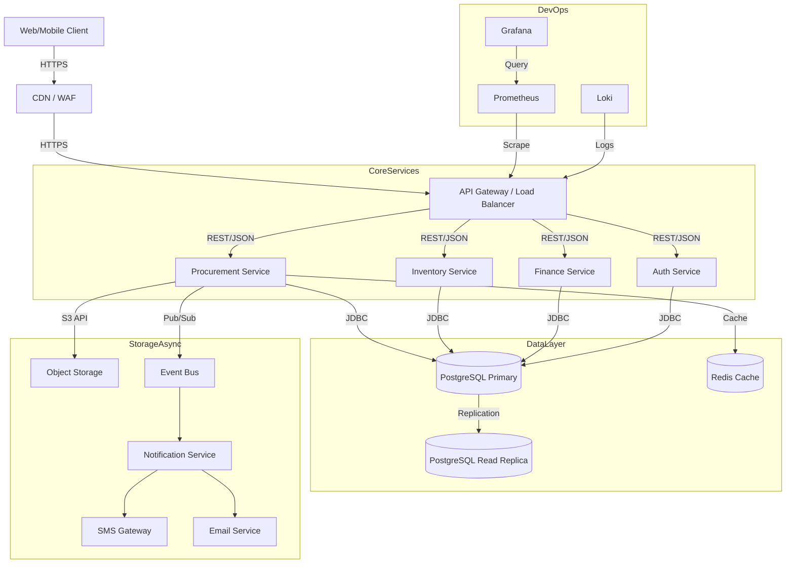

# Architecture

## System Overview

- Backend: Java 21+, Spring Boot 3.5.7 (Security, Data JPA), PostgreSQL 18+.
- Frontend: React 19 (mobile-first), TypeScript, React Router, Axios, Tailwind/MUI.
- Auth: JWT (stateless), HTTPS everywhere; refresh token.
- Storage: PostgreSQL 18+; object storage for uploads (receipts, photos).
- CI/CD: Lint/test on push; migrations via Flyway/Liquibase; Docker for local DB.
- Offline: Frontend offline queue for requests/deliveries; background sync.
- Domains: supports both building and road/bridge projects (aggregates, asphalt, culverts, steel, concrete).

## Roles & Permissions

- **Engineer**: create requests, view history, mark delivery status draft.
- **Storekeeper**: confirm deliveries, log usage/consumption, manage inventory counts.
- **Site Manager/Supervisor**: approve within threshold, oversee site inventory.
- **Project Manager**: approve higher thresholds, see budget vs actual.
- **Procurement**: generate/send POs, manage suppliers, track deliveries in transit.
- **Accountant/Finance**: invoices, VAT/EFD attachments, budget burn, exports.
- **Supplier (optional portal)**: view POs, update delivery status, upload notes.

## Core Domain Modules

- Auth & RBAC (JWT, route guards, role matrix).
- Projects & Sites with budgets and work packages/stages.
- Materials & Units (flexible units: bags, bundles, trips, lorry loads).
- BOQ Integration (Excel upload, BOQ item linkage, overage prevention).
- Requests & Approvals (multi-level thresholds, emergency flag, duplicate alerts).
- Procurement & Suppliers (PO PDF, WhatsApp share link).
- Deliveries (photo+GPS proof, storekeeper sign-off, partials).
- Inventory (stock, consumption logs, forecasts, threshold alerts).
- Finance (PO→Invoice matching, VAT, EFD attachment, exports).
- Audit (immutable logs).

## System Architecture Diagram



## Cross-Cutting Concerns

### 1. Logging & Auditing

- **Structured Logging**: All services output JSON logs (timestamp, trace_id, level, message, context).
- **Centralized Aggregation**: Logs shipped to ELK Stack or Loki for analysis.
- **Audit Trails**: Critical actions (approvals, procurement updates) write to a tamper-proof `audit_logs` table (and potentially an external immutable ledger in future).

### 2. Rate Limiting & Security

- **API Gateway Level**: Token bucket algorithm to limit requests per IP/User (e.g., 100 req/min).
- **DDoS Protection**: WAF fronting the gateway.
- **Circuit Breakers**: Resilience4j implemented in service calls to prevent cascading failures.

### 3. Centralized Configuration

- **Config Server**: Spring Cloud Config or similar to manage environment-specific properties (DB URLs, warm-up toggles) dynamically.
- **Secrets Management**: Vault or GitHub Secrets injected as environment variables; no hardcoded credentials.

### 4. Error Handling

- **Global Exception Handler**: Standardized JSON error response format:
  ```json
  {
    "timestamp": "2023-10-27T10:00:00Z",
    "status": 400,
    "error": "Bad Request",
    "message": "Invalid material ID",
    "path": "/api/requests",
    "trace_id": "req-123xyz"
  }
  ```

### 5. API Gateway Rules

- **Authentication**: Validates JWT before passing to services.
- **Routing**: Semantic routing (`/api/v1/auth/*` -> Auth Service, `/api/v1/projects/*` -> Procurement Service).
- **Correlation**: Injects `X-Trace-ID` header for request tracing across services.

## Deployment Considerations

- Env profiles: dev, staging, prod.
- Object storage: S3-compatible bucket for media.
- CORS: locked to frontend domains.
- Rate limiting on auth and upload endpoints.
- Monitoring: logs, metrics, uptime; DB backups and restore drills.

## Offline Strategy

- Local cache: material catalog, sites, BOQ items, recent requests.
- Queue: pending actions stored locally, retried with exponential backoff.
- Conflict policy: server wins with client prompting to review diffs.
- UX: clear sync status badges; retry/resume controls.
- Road sites often have poor connectivity; prioritize lightweight payloads and deferred media uploads.

## WhatsApp Integration

- Share PO PDF link (signed URL) and approval links.
- Optional delivery photo share back to manager for quick confirmation.
