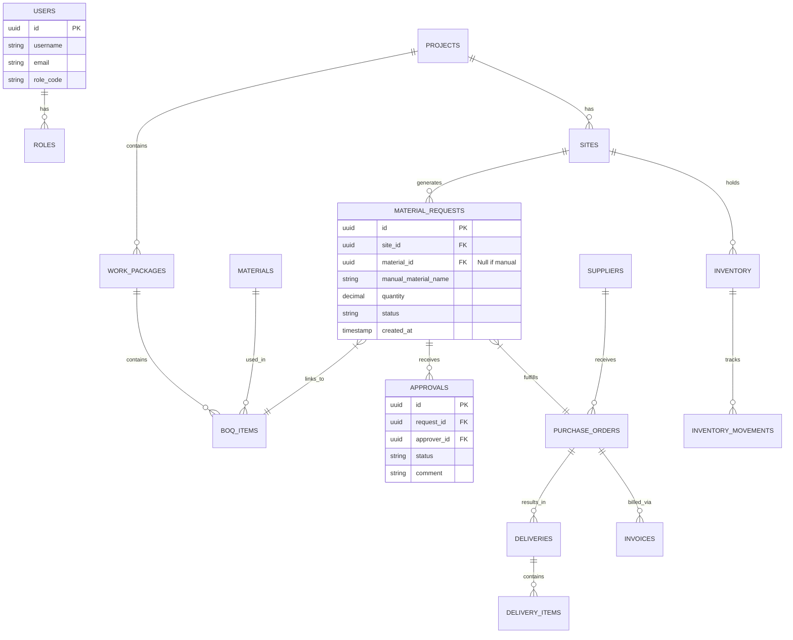

# Data Model (Outline)

## Entities (key fields)

- `users` (id, name, phone, email, role, status)
- `roles` (id, code: ENGINEER/STOREKEEPER/SITE_MANAGER/PROJECT_MANAGER/PROCUREMENT/ACCOUNTANT/SUPPLIER)
- `projects` (id, name, owner, currency default, budget_total)
- `sites` (id, project_id, name, location, budget_cap, gps_center)
- `work_packages` (id, project_id, name, stage)
- `materials` (id, name, category, default_unit, unit_type: bag/bundle/trip/lorry_load/ton/asphalt_drum/culvert/custom, reference_price)
- `units` (id, code, description, conversion_to_base optional)
- `boq_items` (id, project_id, work_package_id, material_id, qty_allowed, unit)
- `material_requests` (id, site_id, boq_item_id optional, material_id optional, manual_material_name, quantity, unit, emergency_flag, planned_usage_start, planned_usage_end, status, requested_by, stage, duplicate_hash, created_at)
- `approvals` (id, request_id, approver_id, decision, comments, amount_estimate, threshold_level, created_at)
- `suppliers` (id, name, contact_phone, whatsapp, address, performance_score)
- `purchase_orders` (id, supplier_id, site_id, total_amount, currency, status, pdf_url, created_from_requests)
- `deliveries` (id, po_id, site_id, delivered_by, received_by, gps_lat, gps_lng, photo_url, status, notes, delivered_qty)
- `delivery_items` (id, delivery_id, material_id, qty, unit)
- `inventory` (id, site_id, material_id, on_hand_qty, unit, updated_at)
- `inventory_movements` (id, site_id, material_id, delta_qty, reason: delivery/usage/adjustment, ref_type/ref_id, created_by)
- `invoices` (id, supplier_id, po_id, currency, fx_rate, vat, total, efd_receipt_url, status)
- `budgets` (id, site_id, material_id optional, cap_amount, spent_amount)
- `audit_logs` (id, actor_id, action, entity_type, entity_id, before, after, ip, gps_lat, gps_lng, created_at)

## Relationships

- User ↔ Role: many-to-one (role codes fixed).
- Project ↔ Sites: one-to-many.
- Project ↔ WorkPackages/BOQ: one-to-many; BOQ links to materials.
- Site ↔ Requests: one-to-many; Request ↔ Approvals: one-to-many.
- Request ↔ PO: many-to-one (PO may cover multiple requests via join table).
- PO ↔ Deliveries: one-to-many; Delivery ↔ DeliveryItems: one-to-many.
- Deliveries and Inventory: deliveries increment stock; usage decrements via movements.
- PO ↔ Invoice: one-to-one or one-to-many (partial invoicing).

## Constraints & Indexes

- Unique `duplicate_hash` on recent window to prevent duplicate requests per site+material+stage.
- Early-reorder guard: if requested material has active planned_usage_end in future and delivered_qty >= prior requested qty, block or require manager override; enforce via server logic with supporting index on `(site_id, material_id, planned_usage_end)`.
- Approval thresholds enforced via business logic + DB check constraints where possible.
- Inventory movements should be append-only; inventory table as derived projection.
- Foreign keys on all relational links; cascade rules chosen conservatively. Note: `material_requests` may have NULL `material_id` for manual entries.
- Indexes: `material_requests(site_id, manual_material_name)`, `material_requests(site_id, material_id, created_at)`, `material_requests(site_id, material_id, planned_usage_end)`, `approvals(request_id)`, `deliveries(site_id, created_at)`, `inventory(site_id, material_id)`, `purchase_orders(supplier_id, created_at)`.

## Audit & History

- `audit_logs` record before/after snapshots; include actor, action, timestamp, IP/GPS.
- Soft-delete fields where needed (e.g., `deleted_at`) to preserve history.

## Currency & Tax

- Monetary fields stored in smallest unit (cents); store currency code (TZS/USD) and fx_rate on money-bearing records.
- Tax: store VAT percentage and amounts on invoices; EFD receipt URL for compliance.

## Files/Media

- Store URLs to object storage for photos, PDFs, EFD receipts; keep metadata (size, mime, checksum).

## Entity Relationship Diagram (ERD)

## Reference Tables

To ensure data integrity and avoid magic strings:

- `workflow_states` (id, code, description, entity_type) - e.g., REQUEST_PENDING, PO_SENT.
- `role_permissions` (role_id, permission_code) - Fine-grained access control.
- `unit_conversions` (from_unit_id, to_unit_id, factor) - Standardizing calculations.

## Soft Delete Strategy

- **Mechanism**: All primary entities (`material_requests`, `purchase_orders`, `users`) include a `deleted_at` timestamp column (nullable).
- **Querying**: Default JPA queries filter out where `deleted_at IS NOT NULL`.
- **Restoration**: Admin tool allows setting `deleted_at = NULL` to restore accidental deletions.
- **Hard Delete**: Scheduled job permanently removes records `deleted_at > 7 years` (retention policy).

## Audit & History Strategy

- **Audit Log Table**: As defined in entities, but extended:
  - `table_name`: The entity being modified.
  - `record_id`: The ID of the specific record.
  - `old_value`: JSON snapshot of state before change.
  - `new_value`: JSON snapshot of state after change.
  - `change_reason`: Optional field for manual overrides.
- **History Tables**: For high-churn tables like `inventory`, we use `inventory_history` which is insert-only on every change to the main table (Trigger-based or Application-level).

## Document Versioning

- **Implementation**: Documents (contracts, BOQs) are stored with a version number.
- **Storage**: Object storage paths include version: `s3://bucket/docs/{doc_id}/v1/file.pdf`.
- **Database**:
  - `documents` table has `current_version` int.
  - `document_versions` table links `document_id` to S3 path, upload timestamp, and version number.
- **Immutability**: Historical versions are never overwritten, only new versions appended.
