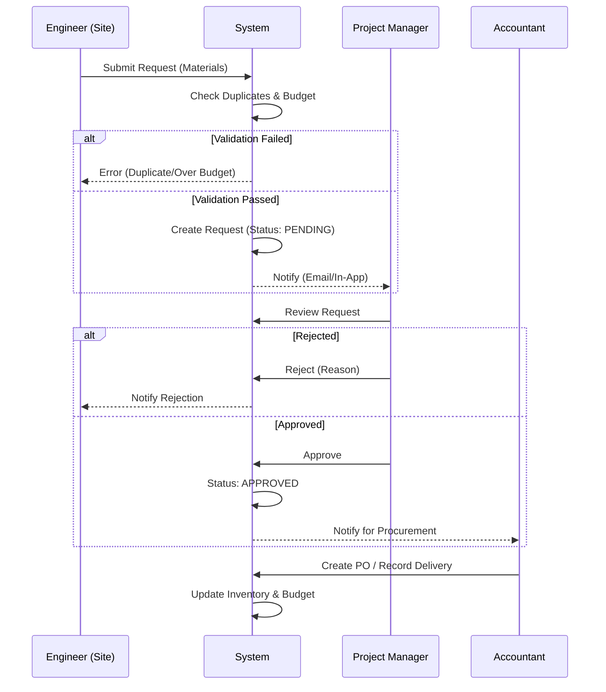

# Workflows (Role-Centric)

## Roles Covered

- Engineer/Technician (site)
- Project Manager/Boss
- Accountant (acts as procurement in MVP)
- Optional: Storekeeper (for projects that separate receiving)
- Optional: Supplier portal (future)

## Material Request (Engineer/Technician)

1. Select site, road section/work package/BOQ item (optional for MVP).
2. **Material Entry**: Choose from standard list OR manually type material name (if not found/new).
   - _Note_: System allows manual entry (e.g., "Mchanga") and will analyze for duplication/standardization later in the backend.
3. Provide planned usage window (start/end or duration) to forecast consumption.
4. Mark emergency flag; client validates required fields offline-capable.
5. Client checks recent duplicates (site + material name) and warns user if they just ordered this.
6. Early-reorder guard: checks previous deliveries against name/ID.
7. Submit → queued if offline → server revalidates duplicates, usage-window guard, and budget availability.
8. Status becomes `PENDING`; audit entry created; notifications to approvers.

## Approvals (MVP)

- Single approver: Project Manager/Boss reviews, approves, or rejects with comments.
- If rejected, engineer edits and resubmits.
- Emergency flag surfaces urgency; manager can override early-reorder guard if justified.
- Audit logs capture actor, decision, comments, timestamp.

## Procurement / Accounting (MVP)

1. Accountant procures approved items (may generate simple PO/PDF to share via WhatsApp/email).
2. Accountant hands over materials to site engineer/technician.
3. Status tracked: delivered, partially delivered, not delivered; partials capture quantities.
4. Budget impact recorded; alerts on overspend.

## Delivery & Confirmation

1. On handover, engineer/technician (or storekeeper if present) records delivery:
   - Select request/PO, capture delivered vs requested (partials allowed), photo, GPS optional, notes.
   - Sign-off stored with role.
2. Inventory increments; any shortfall flagged to Project Manager + Accountant.

## Inventory & Usage

- On delivery: stock increases.
- On usage: engineer/storekeeper logs consumption against work package/BOQ; stock decreases.
- Alerts when below threshold or forecasted to run out; early-reorder guard enforces declared usage window.

## Finance & Invoicing

1. Accountant uploads invoices/receipts (VAT/EFD).
2. Match to request/PO and deliveries; status updated.
3. Budget vs actual updated; exports available (Excel/PDF).

## Offline Sync

- Requests and deliveries can be captured offline; stored in local queue.
- Sync retries with exponential backoff; conflict resolution prompts user.
- Visible sync status badges and manual “retry now”.

## Audit Trail

- Every action logged (who, what, when, where [IP/GPS], before/after).
- Immutable logs; exposed via `GET /api/audit` with filters.

## Workflow Diagrams

## SLAs & Timeout Rules

- **Approval SLA**: Project Managers have **48 hours** to review a standard request.
  - _Escalation_: If > 48 hours, auto-email reminder sent to PM and their supervisor.
- **Emergency SLA**: **4 hours** response time required.
  - _Escalation_: SMS alertsSent every hour if pending.
- **Procurement SLA**: Standard items must be procured within **3 days** of approval.
- **Auto-Rejection**: Draft requests not submitted within **7 days** are auto-archived.
